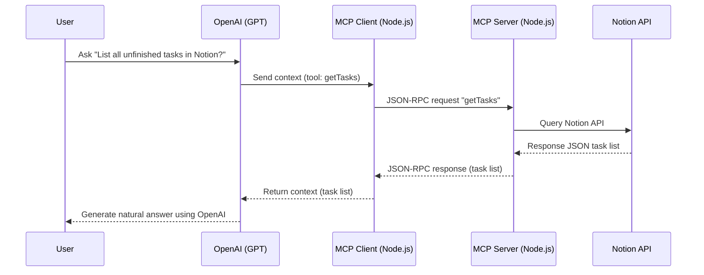

# MCP Demo: OpenAI as Host, Notion as Data Source

This project demonstrates the Model Context Protocol (MCP) pattern with OpenAI (GPT) as the Host, a Node.js bridge as the Client, and Notion as the data source (Server). The app provides a simple web UI for natural language Q&A over your Notion tasks.

## Features
- Ask questions about your Notion tasks in natural language
- OpenAI GPT turns raw Notion data into human-friendly answers
- Modular code: Host, Client, Server, and UI are clearly separated
- JSON-RPC 2.0 between Client and Server

## Architecture



## Setup

1. **Clone the repo & install dependencies:**
	```bash
	git clone ...
	cd mcp-demo
	npm install
	```

2. **Create a `.env` file:**
	```env
	NOTION_TOKEN=your_notion_integration_token
	NOTION_DATABASE_ID=your_notion_database_or_datasource_id
	OPENAI_API_KEY=your_openai_api_key
	```

3. **Start the MCP Server (JSON-RPC):**
	```bash
	node mcpRpcServer.js
	```

4. **Start the main app (Host, Client, UI):**
	```bash
	node server.js
	```

5. **Open your browser:**
	Go to [http://localhost:3000](http://localhost:3000) and ask questions about your Notion tasks!

## File Structure

- `server.js` — Express app, serves UI and acts as Host entrypoint
- `mcpHost.js` — Handles user questions, calls Client, invokes OpenAI for natural answers
- `mcpClient.js` — Sends JSON-RPC requests to MCP Server
- `mcpRpcServer.js` — Receives JSON-RPC, queries Notion API
- `notion.js` — Handles Notion API calls
- `gpt.js` — Handles OpenAI API calls and chat context
- `public/index.html` — Simple web UI

---
Feel free to fork, improve, and share!
