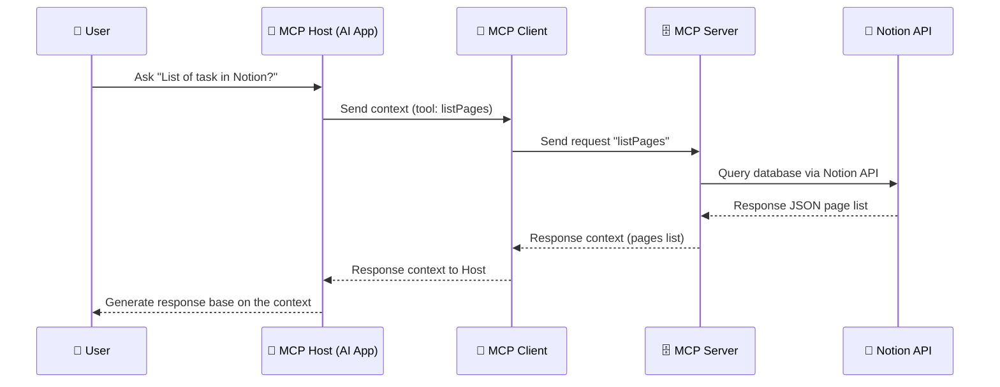

```mermaid
sequenceDiagram
    participant User as 👤 User
    participant Host as 🤖 MCP Host (AI App)
    participant Client as 🔗 MCP Client
    participant Server as 🗄️ MCP Server
    participant Notion as 📒 Notion API

    User->>Host: Ask "List of task in Notion?"
    Host->>Client: Send context (tool: listPages)
    Client->>Server: Send request "listPages"
    Server->>Notion: Query database via Notion API
    Notion-->>Server: Response JSON page list
    Server-->>Client: Response context (pages list)
    Client-->>Host: Response context to Host
    Host-->>User: Generate response base on the context
```